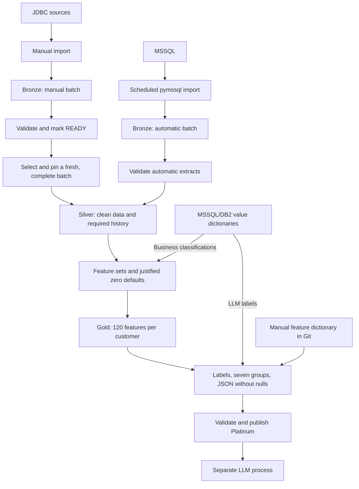
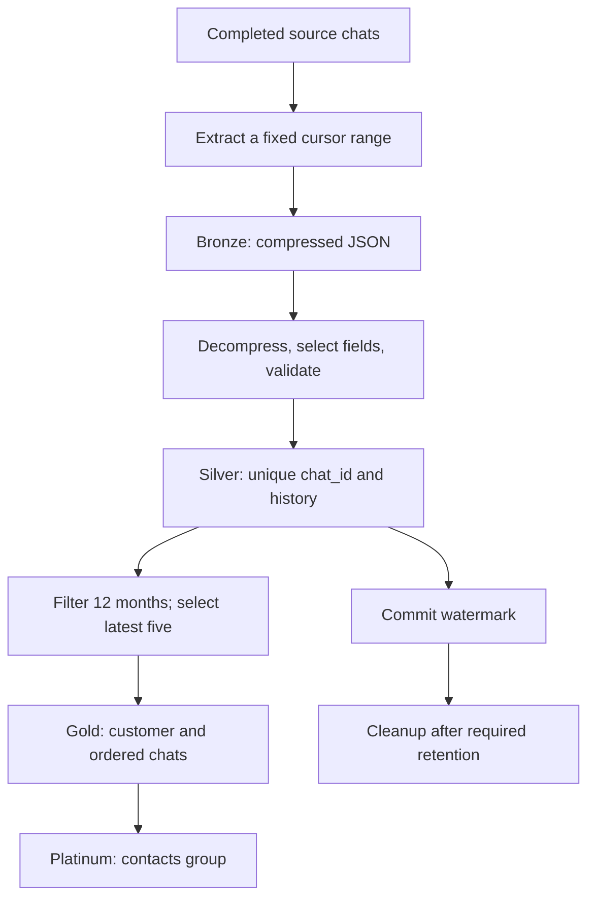

# Customer data pipeline — overview

Version 2.3 · 8 October 2026 · Condensed English design

Related: [technical specification](02_technical_specification.md), [ADRs](03_architecture_decisions.md).

## Purpose

Retail MVP: approximately 15 extracts, 120 features and seven LLM-input JSON groups. Extend through explicit contracts for new segments, sources, tables and columns.

Target: DBR 13.3, Delta, existing metastore, no Unity Catalog. JDBC runs manually; MSSQL/pymssql and downstream processing run automatically.

Use explicit SQL and small, independently testable tasks.

## End-to-end flow

Logical steps need not create physical copies. Failed required inputs block publication; previous output remains available.

## Stages

| Stage | Responsibility |
|---|---|
| Extraction | Select explicit fields or source-side aggregates, such as products by type or top five merchants over 30 days. |
| Bronze | Persist raw payloads or contracted aggregates for replay. Proposed 3–5-day retention applies only to completed automatic batches, never required manual or failed batches. |
| Input checks | Validate schema, keys, completeness and freshness. Pin the selected manual batch throughout the run. |
| Silver | Decompress, parse and retain useful fields/history. Immutable chats have one row per chat_id; insert only new IDs. |
| Feature sets | Calculate domain metrics. Apply business reference data and replace missing values with zero only when complete data proves no activity. |
| Gold | Join validated feature sets into one customer row. Preserve typed fields and structured event arrays. |
| Platinum | Translate presentation codes, map seven groups and serialize JSON. Omit null fields; preserve 0 and false. Keep customer/run identifiers, reference time and schema version separately. |
| Publication and LLM | Validate the candidate before publication. Execute the LLM independently, allowing prompt retries without repeating ETL. |

## Immutable chat flow

Bronze retention does not define extraction coverage: after a week-long outage, recover the entire missing cursor range. Keep required history in Silver—provisionally 13 months for a 12-month window—not a full expanded payload copy. Parser changes may require source rereads.

## Proposed groups

| Group | Content |
|---|---|
| customer_info | Segment, relationship tenure |
| products | Holdings and metrics |
| transactions | Activity, amounts, merchants |
| digital_activity | Digital channel usage |
| contacts | Chats and visits |
| needs_and_preferences | Defined signals and preferences |
| other_signals | Remaining approved features |

Names remain provisional.

## Two dictionaries

**Value dictionaries**, fetched from MSSQL/DB2, translate values: `business_code=5` → `desc_pl="affluent"`. Apply labels in Platinum; business classifications may be needed earlier.

**Feature dictionary**, authored manually in Git, maps technical variables to groups, readable keys and definitions: `dc_pos_30d_amt` → “Amount of debit card POS payments in the last 30 days”. Keep full definitions in shared LLM instructions, short keys in customer JSON; version both together.

## Delivery criteria

Inputs are complete and fresh; Gold and Platinum have one row per customer; retries create no duplicates. Unknown reference codes, stale imports and invalid chats never disappear silently. Recalculate windows even without new events.

Allow isolated manual extracts. Proposed retry: two retries, three attempts total, for transient failures only. Post-MVP: task-run metrics and logging service table.
